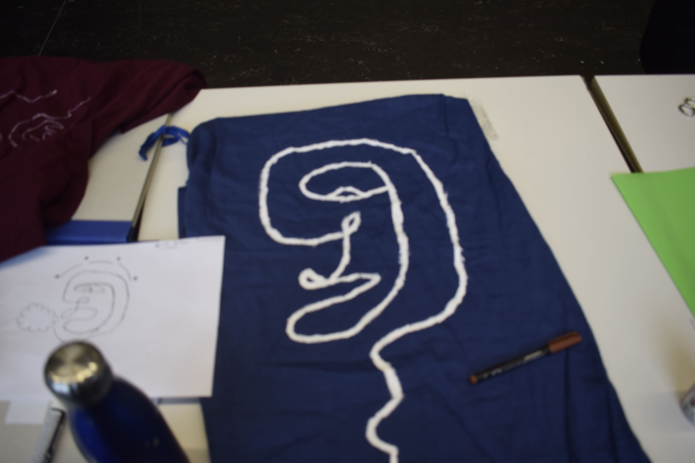
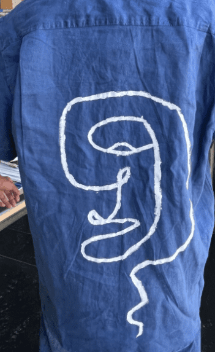

+++
title = "Farbe im Alltag"
date = "2022-05-10"
draft = false
pinned = false
image = "bild1234567.png"
+++

Wir haben im Bildnerischen gestalten den Auftrag bekommen uns eine eigene Aufgabe zu stellen. Ich habe mich dazu entschieden ein Kleidungsstück zu bemalen. \
Dafür brauchte ich natürlich die Farbe und das Kleidungsstück. \
Anfangs wollte ich eine Jeansjacke auswählen, die hätte aber zu sehr auf den Geldbeutel gedrückt und so entschied ich mir für ein Leinenhemd.

Zum Abschluss kann ich sagen, dass die Arbeit in Ordnung war. Es gab aber auch schon BG Aufträge die mir mehr Spass gemacht haben.